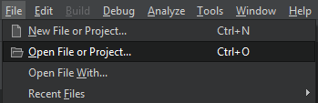
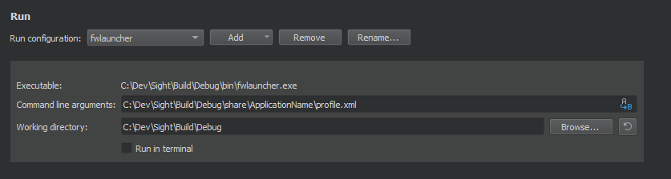

***************************************
How to configure QtCreator on Windows ?
***************************************

Sight contains a substantial amount of code, with numerous nested inclusions, type redefinitions and other advanced
architecture webbings. This makes finding the right IDE and configuring it correctly a bit of a hassle. Below you will
find a guideline to setup QtCreator.

Version and installation
------------------------

We will be using 4.7.2, newer versions may work as well, but we recommend `this one
<https://download.qt.io/official_releases/qtcreator/4.7/4.7.2/qt-creator-opensource-windows-x86_64-4.7.2.exe>`_ .

Installation is pretty straight forward, you only need to make sure the ``CDB Debugger`` is checked (which is the case
by default)

.. image:: media/QtCreator/CDBDebugger.png

Managing your kits
------------------

First and foremost, make sure you open a clean instance of QtCreator (i.e. from a console with a modified PATH
variable. e.g. from the start menu).

Kits are, in QtCreator, a combination of the used compiler, qt version, ``CMake`` versions and Debuggers. This is
specially important if you have installed multiple instances of ``C++`` compilers or other.

For now, just make sure all the paths look correct, and that compilers, as well as the debuggers are found with the
right Visual Studio version.

Below you will find an example of two versions of compilers found by the same QtCreator instance.

.. image:: media/QtCreator/KitCompiler.png

Opening your sight project
--------------------------

You'll need to select the ``CMakeLists.txt`` of your ``Sight`` sources from the ``File>Open File or Project`` menu in
QtCreator

Choosing kit and build location
-------------------------------

You will be asked to chose a kit (Desktop by default) and what type of build you want to configure. You can choose
previously compiled and configured locations of your Sight builds.

.. image:: media/QtCreator/ConfigureProject.png

You will see a similar view to ``cmake-gui`` output, and all the previously set options should be set correctly.

.. image:: media/QtCreator/CMake.png

.. note::
    You can actually perform the `Configuration <Configuration>`_ step directly in QtCreator!

Run your application
--------------------

Remember the automatically generated launch script from before (mentioned `here <Launch an application>`_) ? Now we'll
use the PATH variable modifications it generated in-order to be able to run built applications.

Select the Run tab.

.. image:: media/QtCreator/BuildAndRun.png

In the Run configuration select fwlauncher, here you will find all of the generated tests.
Find the ``profile.xml`` of the application you want to run and fill the ``Command line argument`` with its full path.
Fill-in the ``Working Directory``. Your configuration should look something like this :

And finally, open your application script ``Dev/Sight/Build/bin/ApplicationName.bat`` and copy the whole line
``SET "PATH`` from the ``=`` symbol to the last ``;``. Find the ``Path`` variable and replace it with ``%{PATH};``
followed by the chunk you copied. This sets all Conan path location to your build environment.

.. image:: media/QtCreator/RunEnvironment.png

You can ``Add>Clone Selected`` in order to save this configuration, and you are all set! Try to launch qtCreator
Debugger (F5) and see if it is working properly.

