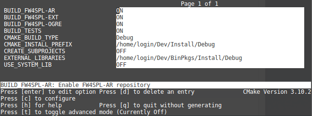

.. warning::
    Do NOT use ninja to compile the dependencies, it causes conflict with qt compilation.

If you get compilation errors at this step, please ensure you installed all the requirements, especially those for `Qt <http://wiki.qt.io/Building_Qt_5_from_Git>`_.

Source
--------

* `Clone <http://git-scm.com/book/en/v2/Git-Basics-Getting-a-Git-Repository#Cloning-an-Existing-Repository>`_ the following repositories in the (Dev/Src) source folder:
    * `sight <https://git.ircad.fr/Sight/sight.git>`_

.. code:: bash

    $ cd Dev/Src
    $ git clone https://git.ircad.fr/Sight/sight.git

* Go into your Build directory (Debug or Release) : here is an example if you want to compile in debug:

.. code:: bash

    $ cd Dev/Build/Debug

Now you have to configure the project. You can use one of the three tools explained above.

Also, for Sight, we recommend to use the `Ninja <https://ninja-build.org/>`_ generator.
It builds faster, and is much better for everyday use because of how fast
it is at figuring out which files need to be built.
In other words, with Ninja the compilation starts instantly whereas Make spends
a dozen of seconds to check what should be compiled before actually compiling something.
So if you plan to develop with Sight, go with Ninja.
If you only want to give a single try, you can live with the standard "Unix Makefiles" generator.

Configuration
~~~~~~~~~~~~~~~~~~~~~~~~

1. NCurses based editor
***********************

To use make, here with ``ccmake`` :

.. code:: bash

    $ cd Dev/Build/Debug
    $ ccmake ../../Src/sight

To use ninja :

.. code:: bash

    $ cd Dev/Build/Debug
    $ ccmake -G Ninja ../../Src/sight

* Change the following cmake arguments
    - ``CMAKE_INSTALL_PREFIX``: set the install location, here ``~/Dev/Install/Debug``
    - ``CMAKE_BUILD_TYPE``: set the build type 'Debug', 'Release', 'RelWithDebInfo' or 'MinSizeRel'
    - ``EXTERNAL_LIBRARIES``: set the install path of the third party libraries
      you compiled earlier.(ex : ~/Dev/Install/Debug)
    - ``PROJECTS_TO_BUILD``: set the list of the projects
      you want to build (ex: VRRender, Tuto01Basic ...), each project should be separated by ";"

* Press *"c"* to configure and then *"g"* to generate the makefiles.

.. note::
    - If ``PROJECTS_TO_BUILD`` is empty, all application will be compiled

Click on "generate".

.. note::

    To generate the projects in release mode, change CMake argument ``CMAKE_BUILD_TYPE`` to ``Release`` **both** for sight and sight-deps

2. Qt based gui
***************

.. code:: bash

    $ cd Dev/Build/Debug
    $ cmake-gui ../../Src/sight

You can then edit the same options than with ``ccmake``.

Build
~~~~~~~~~~~~~~~

Then, according to the generator you chose, build Sight with make :

.. code:: bash

    $ cd Dev/Build/Debug
    # Adjust the number of cores depending of the CPU cores and the RAM available on your computer
    $ make -j4

Or with ninja:

.. code:: bash

    $ cd Dev/Build/Debug
    $ ninja

If you didn't specify anything in ``PROJECTS_TO_BUILD`` you may also build specific targets, for instance:

.. code:: bash

    $ ninja Tuto01Basic VRRender

Launch an application
----------------------

After a successful compilation the application can be launched with the *fwlauncher* program from Sight.
The profile.xml of the application in the build folder has
to be passed as argument to the *fwlauncher* call in the console.

.. code:: bash

    > cd Dev/Build/Debug
    > ./bin/fwlauncher share/MyApplication/profile.xml

Example:

.. code:: bash

    $ cd /Dev/Build/Debug
    $ ./bin/fwlauncher share/VRRender_0-9/profile.xml

[LINUX]: If you can't launch it, try to launch it by using ``LD_LIBRARY_PATH``.

.. code:: bash

    $ cd /Dev/Build/Debug
    $ LD_LIBRARY_PATH=/home/login/Dev2/BinPkgs/Install/Debug/lib/ ./bin/fwlauncher share/sight/OgreViewer-0.2/profile.xml
