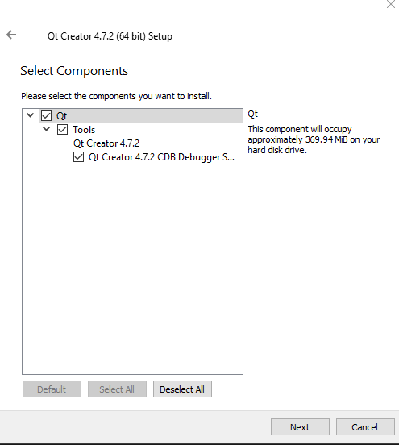
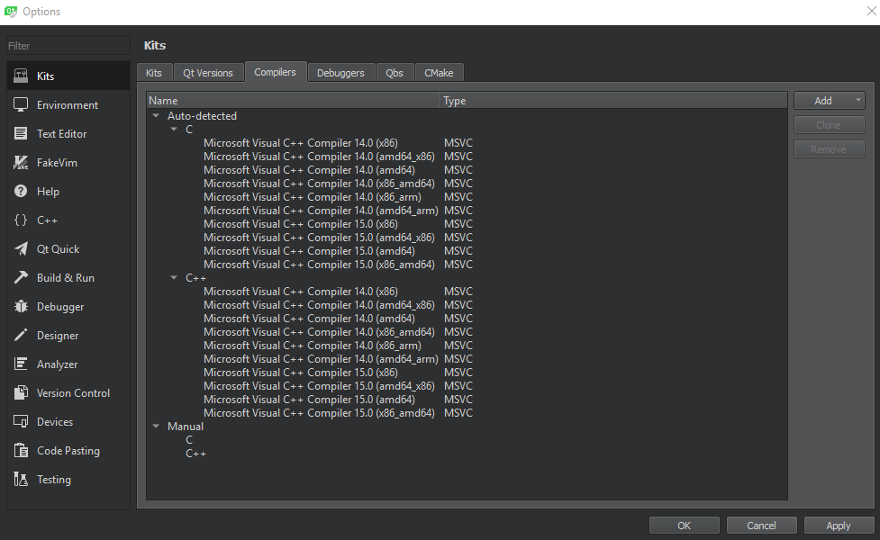
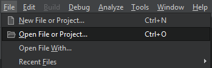
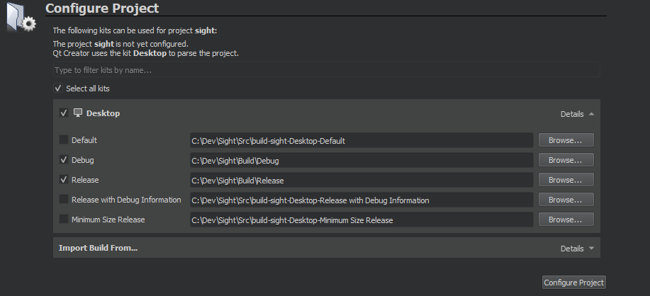
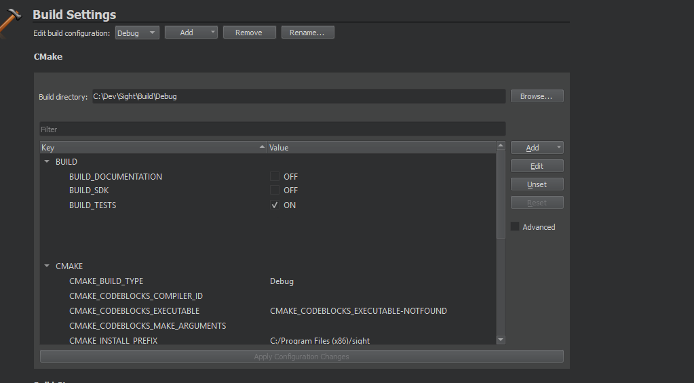
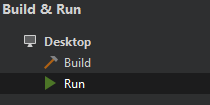
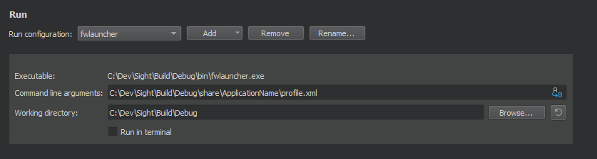
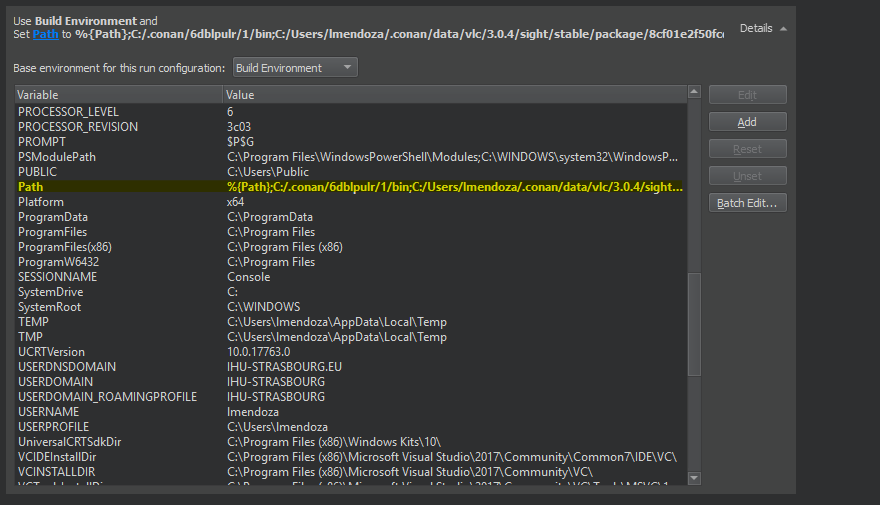

Installation for Windows with Conan
===================================

Introduction
------------

From `Conan documentation <https://docs.conan.io/en/latest/>`_ :

"Conan is a portable package manager, intended for C and C++ developers, but it is able to manage builds from source,
dependencies, and precompiled binaries for any language."

This means that by using Conan we are no longer required to build dependencies ourselves. By following these
instructions
You will be able to build sight with downloaded pre-compiled dependencies.

Note that all dependencies packages can be found in our very own
`Artifactory webpage <https://conan.ircad.fr/artifactory/webapp/#/home>`_

Prerequisites
-------------

If not already installed:

1. Install `git <https://git-scm.com/>`_

2. Optionally you can install `GitKraken <https://www.gitkraken.com//>`_ to manage your repositories

3. Install `Visual Studio 2017 Community <https://visualstudio.microsoft.com/>`_

4. Install `Python 3.5 or greater <https://www.python.org/downloads/>`_

5. Install `CMake <http://www.cmake.org/download/>`_

6. Install `ninja <https://github.com/ninja-build/ninja/releases>`_

7. Install `Conan  <https://docs.conan.io/en/latest/installation.html>`_ using Python's ``pip``

Source tree layout
~~~~~~~~~~~~~~~~~~~~~~

Good practices in Sigth recommend to separate source files, build and install folders.
So to prepare the development environment:

* Create a development folder (Dev)

* Create a build folder (Dev\\Build)

    * Add a sub folder for Debug and Release.

* Create a source folder (Dev\\Src)

* Create a install folder (Dev\\Install)

    * Add a sub folder for Debug and Release.

|directories|

Of course you can name the folders as you wish, or choose a different layout, but keep in mind to not build inside the
source directory. This is strongly discouraged by *CMake* authors.

.. |directories| image:: ../media/DirectoriesNoDeps.png

Setting up your environment
~~~~~~~~~~~~~~~~~~~~~~~~~~~~

Load into your active PATH environment variable the needed locations in-order to be able to build.

* Add Visual studio compilers.

You can use the 'VS2017 x64 Native Tools Command Prompt'  or launch the `vcvarsall.bat` script with the parameter
`amd64` on your current console.
The location of that script will look something like this
``C:\Program Files (x86)\Microsoft Visual Studio\2017\Community\VC\Auxiliary\Build\vcvarsall.bat``

* Add the Prerequisites_

If installed with default parameters ``git``, ``CMake`` and ``Python`` will be automatically loaded into your PATH
variable.

For static binaries like ``Ninja`` you will need to add them manually with a command similar to :

.. code:: bash

    > PATH=%PATH%;C:\Bin

.. tip::

    Writing a ``.bat`` script that loads all these previous locations to your path can save you time and effort!

Building your sources
----------------------

* `Clone <http://git-scm.com/book/en/v2/Git-Basics-Getting-a-Git-Repository#Cloning-an-Existing-Repository>`_ the following repositories in the (Dev\Src) source folder:

    * `sight <https://git.ircad.fr/Sight/sight.git>`_

.. code:: bash

    > cd Dev\Src
    > git clone https://git.ircad.fr/Sight/sight.git

* Go into your Build directory (Debug or Release) : here is an example if you want to compile in debug:

.. code:: bash

    $ cd Dev/Build/Debug

.. warning:: Make sure your environment `is properly set <file:///C:/Dev/Sight/Src/sight-doc/_build/html/Installation/src/WindowsInstallConan.html#setting-up-your-environment>`_ .

* Call cmake-gui.

.. code:: bash

    > cmake-gui

Configuration
~~~~~~~~~~~~~~~~

* Set the desired Build directory (e.g. Dev\\Build\\Debug or Release)

* Set the desired Source directory (e.g. Dev\\Src\\sight)

* Click on "configure".

* During configure step, choose the generator 'Ninja' to compile Sight sources.

Generation
~~~~~~~~~~~~~~

* Set the following arguments:

    * ``CMAKE_INSTALL_PREFIX``: set the install location (e.g. Dev\\Install\\Debug).
    * ``CMAKE_BUILD_TYPE``: set to Debug or Release.
    * ``PROJECTS_TO_BUILD``: set the names of the applications to build (see Dev\Src\Apps or Dev\Src\Samples, ex:
        VRRender, Tuto01Basic ...), each project should be separated by ";".
    * ``USE_CONAN``: This box ensures Conan packages are downloaded instead of relying on local builds. (check advanced
        options)

.. note::
    - If ``PROJECTS_TO_BUILD`` is empty, all application will be compiled

.. warning:: Make sure the arguments concerning the compiler ((Advanced options)) point to Visual Studio.

* click on "generate".

Build
~~~~~~~

* Compile the Sight source using ninja in the console:

    * go to the build directory (e.g. Dev\\Build\\Debug or Release)
    * Use "ninja" if you want to compile all the applications set in CMake.
    * Use "ninja name_of_application" to compile only one of the applications set in CMake.

.. code:: bash

    > cd Dev\Build\Debug
    > ninja

Launch an application
---------------------

After a successful compilation any previously built application can be launched with the appropriate script from Sight.
You will find in the ``Build\bin`` directory an automatically generated ``.bat`` with the same name as the application
you built.

.. code:: bash

    > cd Dev\Build\Debug
    > .\bin\myapplication.bat

.. important::
    This automatically generated script loads all the needed Conan packages locations and adds them temporarily to your
    PATH variable. Feel free to take a look inside.

Generate an installer
---------------------

After setting the applications for which you want to generate installers in the ``PROJECTS_TO_BUILD`` CMake variable
and generating the code, follow these two steps:

    * Run *ninja install application_to_install* in the Build directory
    * Run *ninja package* in the Build directory

The installer will be generated in the Build directory.

Recommended software
--------------------

The following programs may be helpful for your developments:

* `QT Creator 4.7.2 <https://download.qt.io/official_releases/qtcreator/>`_:
    QT Creator is a multi-OS Integrated Development Environment (IDE) for computer programming.
* `Notepad++ <http://notepad-plus-plus.org/>`_:
    Notepad++ is a free source code editor, which is designed with syntax highlighting functionality.
* `ConsoleZ <https://github.com/cbucher/console/wiki/Downloads>`_:
    ConsoleZ is an alternative command prompt for Windows, adding more capabilities to the default Windows command
    prompt. To compile Sight with the console the windows command prompt has to be set in the tab settings.

Setting up QtCreator
--------------------

Sight contains a substantial amount of code, with numerous nested inclusion, type redefinitions and other advanced
architecture webbings. This makes finding the right IDE and configuring it correctly a bit of a hassle. Below you will
find a guideline to setup QtCreator.

Version and installation
~~~~~~~~~~~~~~~~~~~~~~~~~

We will be using 4.7.2, newer versions may work as well, but we recommend `this one
<https://download.qt.io/official_releases/qtcreator/4.7/4.7.2/qt-creator-opensource-windows-x86_64-4.7.2.exe>`_ .

Installation is pretty straight forward, you only need to make sure the ``CDB Debugger`` is checked (which is the case
by default)

Managing your kits
~~~~~~~~~~~~~~~~~~~

First and formost, make sure you open a clean instance of QtCreator (a.k.a. not from a console with a modified PATH
variable. a.k.a from the start menu).

Kits are, in QtCreator, a combination of the used compiler, qt version, ``CMake`` versions and Debuggers this is
specially important if you have installed multiple instances of ``C++`` compilers or other.

For now, just make sure all the paths look correct, and that compilers, as well as the debuggers are found with the
right Visual Studio version.

Below you will find an example of two version of compilers found by the same QtCreator instance.

Opening your sight project
~~~~~~~~~~~~~~~~~~~~~~~~~~~

You'll need to select the ``CMakeLists.txt`` of your ``Sight`` sources from the ``File>Open File or Project`` menu in
QtCreator

Choosing kit and build location
~~~~~~~~~~~~~~~~~~~~~~~~~~~~~~~~

You will be asked to chose a kit (Desktop by default) and what type of build you want to configure. You can choose
previously compiled and configured locations of your Sight builds.

You will see a similar view to ``cmake-gui`` output, and all the previously set options should be set correctly.

.. note::
    You can actually perform the `Configuration <Configuration>`_ step directly in QtCreator!

Run your application
~~~~~~~~~~~~~~~~~~~~~

Remember the automatically generated launch script from before (mentioned `here <Launch an application>`_) ? Now we'll
use the PATH variable modifications it generated in-order to be able to run built applications.

Select the Run tab.

In the Run configuration select fwlauncher, here you will find all of the generated tests.
Find the ``profile.xml`` of the application you want to run and fill the ``Command line argument`` with its full path.
Fill-in the ``Working Directory``. Your configuration should look something like this :

And finally open your application script ``Dev/Sight/Build/bin/ApplicationName.bat`` and copy the whole line
``SET "PATH`` from the ``=`` symbol to the last ``;``. Find the ``Path`` variable and replace it with ``%{PATH};``
followed by the chunk you copied. This sets all Conan path location to your build environment.

You can ``Add>Clone Selected`` in order to save this configuration, and you are all set! Try to launch qtCreator
Debugger (F5) and see if it is working properly.

Need some help? Keep in touch!
-------------------------------

As any active community, we *sighters* are happy to help each other or beginners however we can. Feel free to join us
and share with us your questions or comments at our `Gitter <https://gitter.im/IRCAD-IHU/sight-support>`_ .
We provide support in French, English and Spanish.
